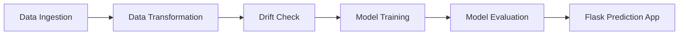

[](https://github.com/PSeshpavan/Student-Performance-Prediction-System/actions/workflows/main.yaml)
# Student Performance Prediction System
An **End-to-End Machine Learning Web Application** designed to predict student academic performance based on demographic and behavioral data. This project demonstrates a production-grade MLOps workflow involving modular code, automated pipelines, experiment tracking, and data versioning.

## 🚀 Key Features

*   **Prediction Pipeline**: A Flask-based web interface for real-time student score predictions.
*   **Automated Training Pipeline**: Orchestrates Data Ingestion, Transformation, Monitoring, and Model Training.
*   **Model Monitoring**: Integrated system to detect **Data Drift** between training and production data using statistical checks.
*   **Experiment Tracking**: Uses **MLflow** (via Dagshub) to log metrics, parameters, and model artifacts.
*   **Data Version Control**: Uses **DVC** to track datasets and ensure reproducibility.
*   **Modular Architecture**: Clean code structure with separate components for Ingestion, Transformation, and Training.

## 🛠️ Tech Stack

*   **Language**: Python 3.8+
*   **Web Framework**: Flask
*   **ML Libraries**: Scikit-learn, XGBoost, CatBoost, Pandas, NumPy
*   **Ops & Tools**: MLflow, DVC, Git, Docker (ready)

## 📂 Project Structure

```
├── artifacts/          # Stores generated files (models, preprocessors, datasets)
├── logs/               # Application and training logs
├── notebook/           # Jupyter notebooks for EDA
├── src/
│   └── my_project/
│       ├── components/ # Core logic (Ingestion, Transformation, Training, Monitoring)
│       ├── pipelines/  # Orchestration scripts (Prediction, Training)
│       ├── logger.py   # Logging configuration
│       └── utils.py    # Utility functions
├── templates/          # HTML templates for Flask
├── app.py              # Flask entry point
├── requirements.txt    # Python dependencies
└── README.md           # Project documentation
```

## ⚙️ Installation & Setup

1.  **Clone the Repository**
    ```bash
    git clone <repository_url>
    cd <repository_name>
    ```

2.  **Create a Virtual Environment**
    ```bash
    python -m venv venv
    source venv/bin/activate  # On Windows: venv\Scripts\activate
    ```

3.  **Install Dependencies**
    ```bash
    pip install -r requirements.txt
    ```

4.  **Set Up Environment Variables**
    Create a `.env` file in the root directory and add your MLflow credentials:
    ```env
    MLFLOW_TRACKING_URI="https://dagshub.com/<username>/DS_Project-1.mlflow"
    MLFLOW_TRACKING_USERNAME="<your_username>"
    MLFLOW_TRACKING_PASSWORD="<your_password>"
    ```

## 🏃‍♂️ Usage

### 1. Run the Web Application
To start the Flask app for predictions:
```bash
python app.py
```
Open your browser at `http://localhost:5000`.

### 2. Run the Training Pipeline
To execute the full training flow (Ingestion -> Monitoring -> Transformation -> Training):
```bash
python -m src.my_project.pipelines.training_pipeline
```
*   **Note**: This pipeline now includes a **Model Monitoring** step that checks for data drift before proceeding to transformation.

## 📊 Modules detailed

*   **Data Ingestion**: Reads from source (SQL/CSV/API), splits into Train/Test, and saves artifacts.
*   **Model Monitoring**: Compares statistical properties (Mean, Std Dev) of the new data against the training baseline to alert on drift.
*   **Data Transformation**: Handles missing values, performs One-Hot Encoding for categorical variables, and scales numerical features.
*   **Model Trainer**: Trains multiple models (Random Forest, Decision Tree, Gradient Boosting, Linear Regression, XGBRegressor, CatBoost, AdaBoost), checks their performance, and saves the best one (threshold: R2 > 0.6).

## 🏆 Model Performance

After evaluating multiple regressors, the winning model is **Linear Regression**. The performance metrics on the test dataset are explicitly stated below:

*   **R2 Score**: 0.8852
*   **Mean Absolute Error (MAE)**: 4.1744
*   **Root Mean Squared Error (RMSE)**: 5.4489

## 📈 Data Drift Monitoring

The monitoring component systematically checks for data drift between the training (reference) data and any new/incoming (current) data before moving to the transformation stage.
*   **Mechanism**: Compares statistical properties (Mean and Standard Deviation) for all numerical features.
*   **Threshold**: Drift is triggered if the absolute difference in the mean of any feature between the reference and current dataset exceeds **1.0 standard deviation** (`diff > train_std * 1.0`). If drift is detected, the pipeline alerts the system, indicating a potential need for model retraining.

## 🏗️ Project Architecture



Test Deploy 1